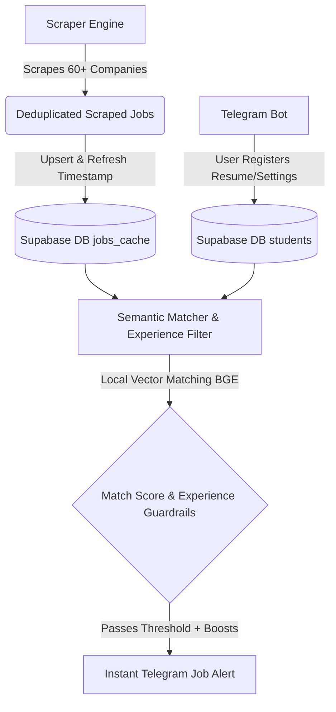

# HiringRadar 🎯

HiringRadar is an automated, real-time job matching and alert system built for college students and freshers. It scrapes job boards from **60+ top-tier product companies and startups**, parses qualifications, runs local **semantic vector embeddings matching** against candidate resumes, and delivers high-relevance alerts instantly via Telegram.

---

## 🚀 Key Features

*   **Multi-Platform Automated Scrapers:** Custom scraping engine tracking Greenhouse, Lever, Ashby, Keka Hire, iCIMS, Workday, and custom APIs (like Amazon Jobs).
*   **Local Semantic Matching Engine:** Employs `BAAI/bge-small-en-v1.5` embeddings locally via `sentence-transformers` to match candidate resumes with job descriptions (no API costs or rate-limits).
*   **Fresher & Student Guardrails:** 
    *   Automatic concatenation of job qualifications to block mid-level roles (e.g., matching 2+ years requirements).
    *   Custom scoring boosts (+10%) for explicit internship and early-career listings to prioritize them on the user's feed.
    *   Graduation batch-year priority filters.
*   **Fast Database Cache:** Uses Supabase for high-performance job caching and subscriber state management.
*   **Instant Notifications:** Integrates with Telegram Bot API to deliver matches directly to candidate chatrooms.

---

## 🎯 Target Companies Tracked

HiringRadar is configured and optimized to fetch, parse, and match listings from target high-growth technology companies and financial institutions:

*   **Tech Giants & Core Product:** Google, Microsoft, Amazon, Stripe, Rubrik, Visa, Mastercard
*   **Finance & Investment Banking:** JPMorgan Chase, Goldman Sachs, Morgan Stanley, Barclays, American Express, Deutsche Bank
*   **High-Growth Startups:** Razorpay, PhonePe, CRED, Groww, Paytm, Meesho, and more.

---

## ⚙️ Target SDE Requirement Alignment

HiringRadar's matching engine aligns candidate profiles to the distinct hiring criteria of our target company segments:

### 1. FAANG & Big Tech (Amazon, Google, Microsoft)
*   **The Bar:** Deep focus on Data Structures & Algorithms (DSA), system design foundation, and horizontal scaling.
*   **HiringRadar Alignment:** Flags target graduation batch years (e.g., *2027 grads*), matches on core programming paradigms (Python, C++, Java), and flags containerization and cloud scaling experience (AWS, Docker, Kubernetes).

### 2. High-Bar Fintech & Investment Banking (Stripe, Goldman Sachs, JPMorgan Chase, Morgan Stanley, Barclays, Deutsche Bank, Amex)
*   **The Bar:** High-throughput backend systems, secure API gateways, database transactions, and low-latency execution.
*   **HiringRadar Alignment:** Prioritizes backend technologies (FastAPI, Node.js), relational query design (PostgreSQL, SQL, database indexing), secure authentication (JWT, OAuth), and Unix/Linux system fundamentals.

### 3. Scaled Enterprise Product (Rubrik, Visa, Mastercard)
*   **The Bar:** Data resiliency, caching layer optimization, storage operations, and cloud resource management.
*   **HiringRadar Alignment:** Ranks candidates on storage systems, caching layers (Redis), container orchestration, and CI/CD pipelines.

---

## 📐 System Architecture



---

## 🛠️ Technology Stack

*   **Language:** Python 3.11+
*   **Database:** Supabase (PostgreSQL)
*   **Vector Embeddings:** Sentence-Transformers (`BAAI/bge-small-en-v1.5`)
*   **Libraries:** Requests, BeautifulSoup4, PyPDF2 (for resume ingestion)
*   **Deployment:** Systemd service on AWS EC2, automated webhook deployment

---

## 🏃 Setup & Running

### 1. Installation
Clone the repository and install the dependencies:
```bash
git clone https://github.com/ishcares/HiringRadar.git
cd HiringRadar
python -m venv venv
source venv/bin/activate  # On Windows: venv\Scripts\activate
pip install -r requirements.txt
```

### 2. Environment Variables
Create a `.env` file in the root directory:
```env
TELEGRAM_BOT_TOKEN=your_telegram_bot_token
SUPABASE_URL=your_supabase_project_url
SUPABASE_KEY=your_supabase_anon_or_service_key
```

### 3. Run Locally
To run the Telegram Bot:
```bash
python bot.py
```

To manually trigger the scraping loop and cache updates:
```bash
python -m scratch.trigger_scrape
```

---

## 📁 Project Structure

*   [bot.py](file:///c:/Users/ishit/OneDrive/Desktop/HiringRadar/bot.py) - Telegram bot handler for subscriber management, resume uploading, and admin functions.
*   [scraper.py](file:///c:/Users/ishit/OneDrive/Desktop/HiringRadar/scraper.py) - Scraper engine for Greenhouse, Lever, Ashby, Keka, iCIMS, Workday, and Amazon.
*   [matching.py](file:///c:/Users/ishit/OneDrive/Desktop/HiringRadar/matching.py) - Filters job levels, parses graduation batch details, and manages candidate-role scoring.
*   [embeddings.py](file:///c:/Users/ishit/OneDrive/Desktop/HiringRadar/embeddings.py) - Calculates local cosine similarities using vector embeddings.
*   [db.py](file:///c:/Users/ishit/OneDrive/Desktop/HiringRadar/db.py) - Supabase PostgreSQL CRUD operations.
